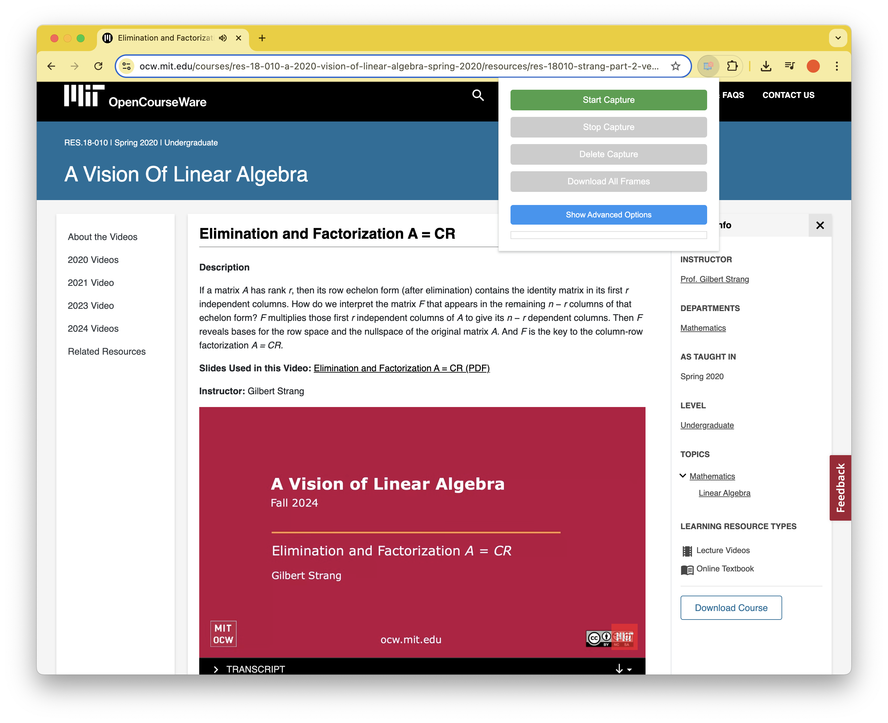
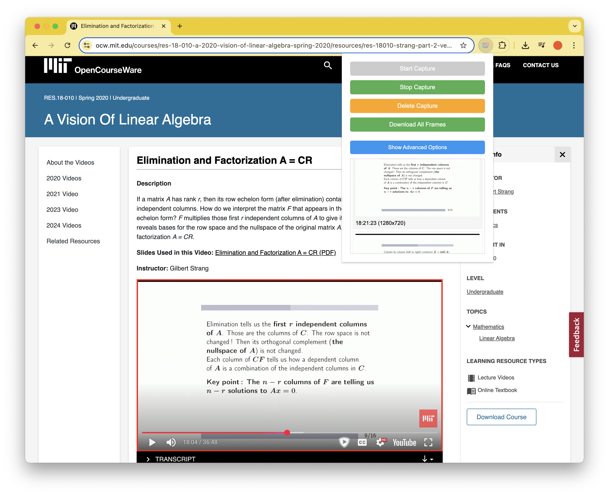

# SlideCapture

A Chrome extension for capturing the shared slides from a streaming feed (such as that from a conference live stream or a zoom call).

It works by detecting the video element on the page and then capturing the current frame from that video, every second. 
To not save the same slide twice, it uses [perceptual hashing](https://en.wikipedia.org/wiki/Perceptual_hashing) (using the pHash algorithm) to detect when a frame has changed more than 5%. For efficiency, it first uses [average hashing](https://www.hackerfactor.com/blog/index.php?/archives/432-Looks-Like-It.html) to compare the average luminance of the thumbnails of the frames to only run phash on the frames for which the average hash is not identical (which is 10x quicker than running phash on all frames).
Once video is playing, press "Start Capture" to start capturing the shared slides. When finished, press "Download All Frames" to download all the captured frames as a ZIP file.
For best results, set the video quality as high as possible in the video player.

Illustrative example of extension in action before and after hitting "Stop Capture":

## Required Permissions 🔒

This extension requires the following permissions to function properly:

- **Active Tab**: Required to access and capture content from the current tab where the video is playing
- **Storage**: Used to save capture settings (crop direction, width/height percentages) and temporarily store captured frames
- **Scripting**: Needed to inject content scripts that detect and interact with video/canvas elements on the page
- **Tabs**: Required to check if the current tab is valid for capture and to handle tab updates
- **Host Permission**: Required to access video content from various streaming platforms and video players

These permissions are requested with the minimum scope necessary for the extension to function. The extension only accesses the active tab when capturing is enabled and does not collect any personal data.

## Advanced Features

Pressing the advanced options will allow specifying the crop direction and the width and height percentages of the captured frame (if for example only part of the video feed is the slides, and the rest is a header or banner)

- Customizable frame cropping
- Multiple crop directions (9 positions)
- Adjustable width and height percentages

## Installation ⚙️ (Manual)

Since this extension is not available on the Chrome Web Store (I did not want to pay Google), follow these steps to install it manually:

1. Download or clone this repository to your local machine
2. Open Chrome and navigate to `chrome://extensions/`
3. Enable "Developer mode" by toggling the switch in the top-right corner
4. Click "Load unpacked" and select the extension directory
5. The extension should now be installed and visible in your Chrome toolbar

## Usage 🚀

1. Navigate to a webpage containing video content
2. Click the extension icon in your Chrome toolbar to open the popup
3. Click "Start Capture" to begin capturing frames
4. Use the advanced options to customize capture settings:
   - Select crop direction (9 positions available)
   - Adjust width and height percentages
5. Click "Stop Capture" when you're done
6. Use "Download All Frames" to save all captured frames as a ZIP file

## Contribute 🧑‍🏫
I have only tested this on one conference so far, so I am sure there are some edge cases that are not handled.
If you find any issues, please let me know or create a pull request.

## License 📝
This project is licensed under the [GPLv3](https://choosealicense.com/licenses/gpl-3.0/) license. See the LICENSE file for details.